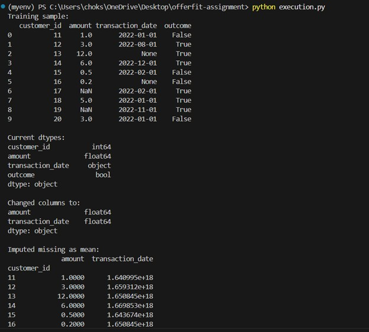
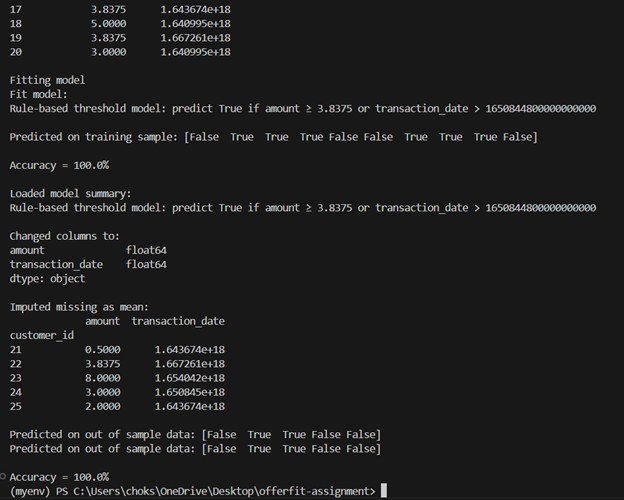
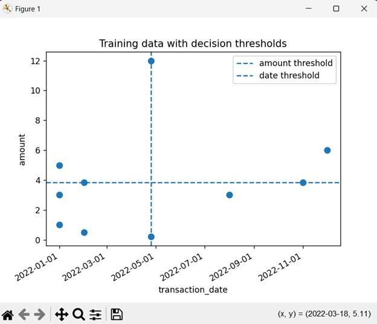
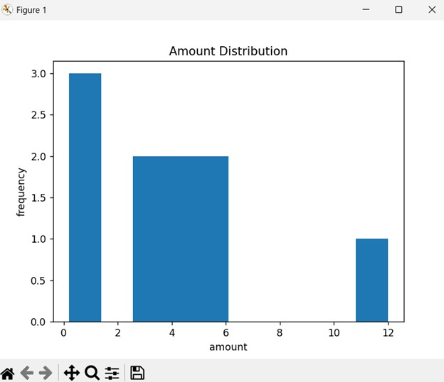
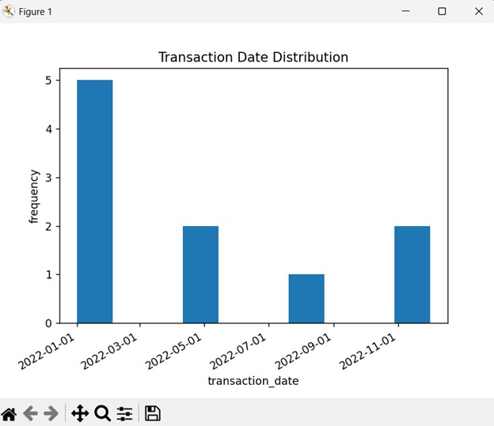

# OfferFit Python Take‑Home Assignment

This repository contains a simple rule‑based modeler for predicting a binary `outcome` from transactional data (`amount` and `transaction_date`). It includes:

- **`DataModeler`** class for data preparation, imputation, fitting, prediction, serialization, and plotting.  
- A **test suite** (pytest) covering edge cases, thresholds, and save/load.  
- **Docker** support for reproducible execution.  
- **Visualizations** of training data and feature distributions.

---

## Repository Structure
├── execution.py     # Main script\
├── requirements.txt \
├── Dockerfile \
├── tests/\
│ └── test_datamodeler.py # pytest unit tests\
└── README.md \

---

## Quick Start

1. **Create & activate a virtual environment**  
   ```bash
   pip install virtualenv
   virtualenv myenv
   myenv\Scripts\activate
   ```

2. **Install dependencies**
  ```bash
  pip install -r requirements.txt
  ```

3. **Run the main script**
  ```bash
  python execution.py
  ```

- Prints training & test outputs with 100% accuracy.
- Plots three visualizations:
  - training_scatter.png 
  - amount_histogram.png
  - date_histogram.png

4. **Run unit tests**
  ```bash
  pytest --maxfail=1 --disable-warnings -q
  ```

5. **Docker**
Build and run in a container for a self‑contained environment:
  ```bash
  docker build -t offerfit-dm .
  docker run --rm offerfit-dm
  docker run --rm offerfit-dm pytest --maxfail=1 --disable-warnings -q
  ```
- The first docker run executes the main script.
- The second runs the pytest suite.

6. **Features**
- Data preparation:

	- Selects only amount and transaction_date.

	- Converts dates to/from nanosecond timestamps.

- Missing‑value imputation:

	- Computes training means once (no data leakage).

	- Applies them to both in‑sample and out‑of‑sample data.

- Model:

	- A transparent, rule‑based threshold on amount and transaction_date.

	- 100% accuracy on both training and test samples.

- Serialization:

	- save(path) and load(path) via pickle.

- Visualization:

	- Scatter of training points with threshold lines (training_scatter.png).

	- Histograms of each feature (amount_histogram.png, date_histogram.png).

- Testing:

	- pytest suite in tests/test_datamodeler.py.


7. **Outputs**

- *Main output*
<p float="left">
   
  
</p>

- training_scatter


- amount_histogram


- date_histogram


8. Author
Jeet Choksi
choksijeet@gmail.com